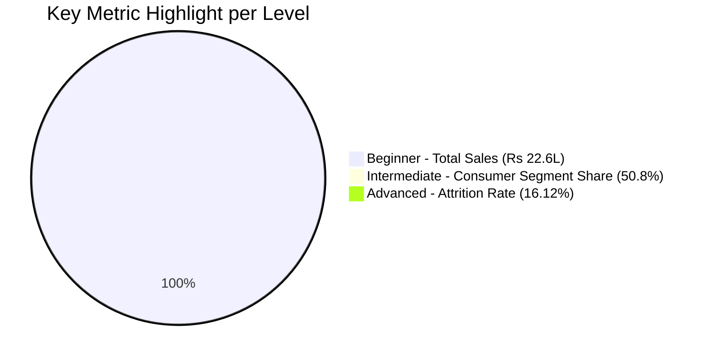

<p align="center">
  
</p>

<p align="center">
  
</p>

<p align="center">
  
  
  
  
  
</p>

<p align="center">
  
</p>

<div align="center">

━━━━━━━━━━━━━━━━━━━━━━━━━━━━━━━━━━━━━━━━━━━━━━━━━━━━━━━━━━━━━━

</div>

---

# 📌 About This Repository

This repository contains all the **Data Analyst tasks** completed during my **ShadowFox Data Analyst Internship**, structured across three progressive levels:

- 🧹 Data Cleaning & Preparation
- 📊 KPI Design & Trend Analysis
- 👥 Customer, Segment & Revenue Analysis
- 🤖 Interactive, AI-Assisted Dashboarding (Power BI)
- 📝 Insight-Driven Recommendations

<p align="center">
  
</p>

---

# 🗂️ Levels in this Repository

<table align="center">
  <tr>
    <th>#</th>
    <th>Level</th>
    <th>Focus</th>
    <th>Tool</th>
    <th>Key Result</th>
  </tr>
  <tr>
    <td>1️⃣</td>
    <td><a href="./01_Beginner_Level">🟢 BEGINNER — RETAIL SALES DASHBOARD</a></td>
    <td>KPIs & Trend Analysis</td>
    <td>Excel</td>
    <td><b>₹22.6L</b> Sales Analyzed</td>
  </tr>
  <tr>
    <td>2️⃣</td>
    <td><a href="./02_Intermediate_Level">🟡 INTERMEDIATE — CUSTOMER & REVENUE ANALYSIS</a></td>
    <td>Segments & Concentration</td>
    <td>Excel</td>
    <td><b>50.8%</b> Revenue from Consumer Segment</td>
  </tr>
  <tr>
    <td>3️⃣</td>
    <td><a href="./03_Advanced_Level">🔴 ADVANCED — EMPLOYEE ATTRITION DASHBOARD</a></td>
    <td>Interactive BI Dashboard</td>
    <td>Power BI</td>
    <td><b>16.12%</b> Attrition Rate</td>
  </tr>
</table>

---

# 1️⃣ 🟢 Beginner — Retail Sales Dashboard

Analyzes ~9,800 retail orders to build a clean, KPI-driven Excel dashboard covering sales, orders, and trends.

## 🎯 Dashboard Overview

| KPI | Value |
|-----|-------|
| 💰 Total Sales | ₹22,61,537 |
| 🧾 Total Orders | 9,800 |
| 📊 Avg Order Value | ₹231 |
| 🏆 Top Category | Technology |
| 🌍 Top Region | West (31%) |
| 📉 Weakest Region | South (17%) |

## 📊 Visuals Included

| Visual | Description |
|--------|-------------|
| 🃏 KPI Cards | 4 Key Metrics |
| 📈 Line Chart | Monthly Sales Trend (2015–2018) |
| 📊 Bar Chart | Sales by Category |
| 🥧 Pie Chart | Revenue Share by Region |

## 🔑 Key Insight

Clear seasonal sales spike every **Sep–Nov**, with steady year-over-year growth from 2015 to 2018.

📁 **[View Full Level →](./01_Beginner_Level)**

---

# 2️⃣ 🟡 Intermediate — Customer & Revenue Analysis


Goes beyond summaries into customer behavior, segment performance, and revenue concentration, ending in 6 data-backed recommendations.

## 🎯 Dashboard Overview

| KPI | Value |
|-----|-------|
| 👥 Unique Customers | 793 |
| 🔁 Repeat Customers | 787 (99%) |
| 💎 Top 10 Customers' Share | 6.8% |
| 🏢 Consumer Segment Share | 50.8% |
| 📦 Top Sub-Category | Phones (₹3.28L) |

## 📊 Visuals Included

| Visual | Description |
|--------|-------------|
| 📋 Table | Customer-Level Breakdown |
| 📊 Bar Chart | Sales by Segment |
| 📊 Bar Chart | Top 10 Sub-Categories by Revenue |

## 💼 Segment Performance

| Segment | Total Sales | Share |
|---------|------------|-------|
| Consumer | ₹11,48,061 | 50.8% ⭐ |
| Corporate | ₹6,88,494 | 30.4% |
| Home Office | ₹4,24,982 | 18.8% |

## 🔑 Key Insight

Revenue is well-diversified across customers (low concentration risk), but **Consumer segment alone drives over half of total revenue**.

📁 **[View Full Level →](./02_Intermediate_Level)**

---

# 3️⃣ 🔴 Advanced — Employee Attrition Analysis Dashboard

> Interactive Power BI Dashboard analyzing the
> drivers of employee attrition using AI-powered
> Key Influencers | 1,470 Employees Dataset

## 🎯 Dashboard Overview

| KPI | Value |
|-----|-------|
| 👥 Total Employees | 1,470 |
| 🚪 Attrition Count | 237 |
| 📉 Attrition Rate | 16.12% |
| 💰 Avg Monthly Income | ₹6.50K |
| ⏰ OverTime Attrition Share | 46.41% |
| 🏢 Top Department (Attrition) | Research & Development |
| 🎯 Attrition Benchmark | 15.00% (Gauge Target) |

## 📊 Visuals Included

| Visual | Description |
|--------|-------------|
| 🃏 KPI Cards | 4 Key Metrics |
| 🎛️ Gauge Chart | Attrition Rate vs Target |
| 🍩 Donut Chart | Attrition by OverTime |
| 🥧 Pie Chart | Attrition by Gender |
| 📊 Bar Chart | Attrition Count by Department |
| 📊 Bar Chart | Attrition by Marital Status |
| 📈 Line Chart | Employee Tenure vs Attrition |
| 🤖 AI Visual | Key Influencers of Attrition |
| 🎛️ Slicers | Department, Gender & OverTime Filter |

## 🤖 AI-Detected Key Influencers

| Factor | Attrition Risk |
|--------|----------|
| Age ≤ 21 | 3.57× ⭐ |
| OverTime = Yes | 2.93× |
| JobRole = Sales Representative | 2.70× |

## 🏢 Attrition Count by Department

| Department | Attrition Count |
|-------------|---------|
| 🔴 Research & Development | 133 |
| 🟡 Sales | 92 |
| 🟢 Human Resources | 12 |

## ⏰ Attrition by OverTime

| OverTime | Attrition Count | Share |
|-------------|---------|---------|
| No | 127 | 53.59% |
| Yes | 110 | 46.41% |

## 💍 Attrition by Marital Status

| Status | Count |
|---------|---|
| Married | 673 |
| Single | 470 |
| Divorced | 327 |

## 🔑 Key Insight

Overall attrition rate is **16.12%** — modestly above the 15% healthy benchmark. Employees aged **≤21** and those working **OverTime** are the strongest attrition drivers.

📁 **[View Full Level →](./03_Advanced_Level)**

---

# 📊 Overall Performance Snapshot



---

# 📂 Repository Structure

```text
ShadowFox-DataAnalyst-Internship/
│
├── 01_Beginner_Level/
│   └── Retail_Sales_Dashboard.xlsx
│
├── 02_Intermediate_Level/
│   └── Superstore_Intermediate_Analysis.xlsx
│
├── 03_Advanced_Level/
│   ├── Employee_Attrition_Analysis_Dashboard.pbix
│   └── Advanced_Level_Insights_Recommendations.docx
│
├── Internship_Final_Report.docx
├── Internship_Task_Presentation.pdf
└── README.md   ← (this file)
```

---

# 🛠️ Technologies Used

<p align="left">
  
</p>


- Microsoft Excel
- Power BI Desktop
- Power Query
- DAX
- Kaggle Datasets (Superstore Sales, IBM HR Analytics)

---

# 🚀 How to Explore

```bash
git clone https://github.com/adityasharma2468/ShadowFox-DataAnalyst-Internship.git
```

```bash
cd ShadowFox-DataAnalyst-Internship
```

Open any level's `.xlsx` file in Excel, or the `.pbix` file in Power BI Desktop.

---

# 📈 Future Improvements

- [ ] Add cohort-based retention analysis to Intermediate level
- [ ] Publish Power BI dashboard to Power BI Service for live sharing
- [ ] Add drill-through pages to the Advanced dashboard
- [ ] Automate monthly data refresh via Power Query parameters
- [ ] Build a companion Streamlit app for quick metric lookups

---

# 🎥 Submission Checklist

- [x] GitHub repository (this repo)
- [x] Final written report — [`Internship_Final_Report.docx`](Internship_Final_Report.docx)
- [x] Presentation deck — [`Internship_Task_Presentation.pdf`](Internship_Task_Presentation.pdf)
- [x] Self-recorded walkthrough video (submitted separately via Google Drive link)

---

# 🎓 Internship Program

<div align="center">

Built as part of the **ShadowFox Data Analyst Internship**
Mentor: **Mr. Aakash**  ·  Batch: **August 2026**

</div>

---

<div align="center">

### 📫 Let's Connect

<a href="https://github.com/adityasharma2468">

</a>
<a href="https://www.linkedin.com/in/aditya-kumar-sharma-137503316?utm_source=share_via&utm_content=profile&utm_medium=member_android">

</a>
<a href="mailto:adityajjkl773975@gmail.com">

</a>

<br><br>

⭐ **If you found this internship work interesting, don't forget to Star this repository!**

</div>

<p align="center">
  
</p>
